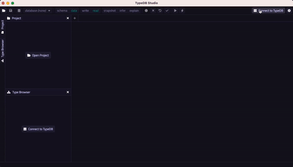
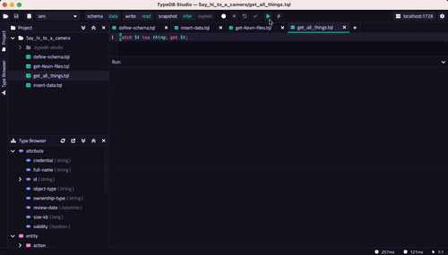
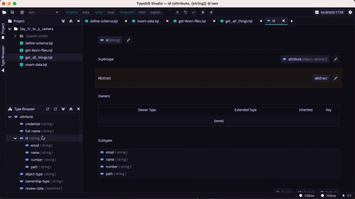

[](./docs/images/studio_full_1.png)

<div align="center">

[](https://factory.vaticle.com/vaticle/typedb-studio)
[](https://circleci.com/gh/vaticle/typedb-studio/tree/master)
[](https://github.com/vaticle/typedb-studio/releases/latest)
[](https://typedb.com/discord)
[](https://forum.typedb.com)
[](https://stackoverflow.com/questions/tagged/typedb)
[](https://stackoverflow.com/questions/tagged/typeql)

</div>

# Introducing TypeDB Studio

TypeDB Studio is an Integrated Development Environment (IDE)
that facilitates the development process for TypeDB databases.
It provides a consistent experience across different operating systems, including macOS, Linux, and Windows.
With TypeDB Studio, developers can efficiently manage databases, execute queries,
and explore query results, all within a unified environment.

## Top features

### Clean and intuitive design

TypeDB Studio offers a clean and intuitive GUI for various tasks related to TypeDB databases.
It, for example, allows developers to effortlessly create and delete databases and provides functionality to insert, 
modify, and query data directly within the IDE.
The latter feature is particularly useful in production environments, 
allowing developers to quickly address issues and make data-related changes.

[](./docs/images/create.gif)

### Data visualization

One of the key features of TypeDB Studio is its interactive visualizer, 
which allows developers to visualize query results and explore inferred data.
The visualizer presents data in a hypergraph format,
making it easy to navigate and understand the relationships between entities and attributes.

[](./docs/images/query.gif)

### GUI for schema management

TypeDB Studio also includes a schema manager with a graphical interface,
making it convenient for developers to edit, visualize, and maintain their data models.
The user-friendly interface simplifies the process of creating, extending, exploring, and managing schemas,
enabling developers to easily define the structure and relationships of their data.

[](./docs/images/edit.gif)

## Fully-fledged IDE for developing with TypeDB

TypeDB Studio covers all steps of the development process with TypeDB:

- Graphical user interface for connecting to TypeDB Core & Enterprise without the use of command line tools, libraries,
  or Driver API.
- Database manager to create and delete databases.
- Type browser for exploring type hierarchy of a database's schema.
- Type editor for adjusting existing types in a database.
- Convenient multi-tab query editor with TypeQL syntax highlighting, auto-saving, query execution, response output, 
  and pop-up notifications for warnings and error messages that may occur during runtime/query execution.
- Project folder file management to store your favorite queries.
- Graph visualization engine for visualizing query results using user-modifiable, force-directed graph drawings.
- Local syntax validation before sending instructions and queries to the server.
- Automatic transaction management with full GUI control, including read/write transactions, schema/data sessions, as 
  well as transaction control (commit/rollback/close) and transaction options.
- Rule-based inference enabled with a click of a button (`infer`).
- Explanations visualization displays the deductive reasoning behind inferred data for accountability.

## Download TypeDB Studio

You can download TypeDB Studio from the [GitHub Releases](https://github.com/vaticle/typedb-studio/releases) page.
See the [Installation guide](https://typedb.com/docs/home/install#_studio).

## Compiling and Running TypeDB Studio from Source

> Note: You **DO NOT NEED** to compile TypeDB Studio from source if you just want to use TypeDB Studio. You can
> simply download TypeDB Studio following the _"Download TypeDB Studio"_ section above.

1. Make sure you have the following dependencies installed on your machine:
    - Java JDK 11 or higher
    - [Bazel 6 or higher](https://bazel.build/install).
 
2. You can build TypeDB with either one of the following commands, depending on the targeted architecture and 
   operating system: 
   ```sh
   $ bazel run //:studio-bin-mac-arm64
   $ bazel run //:studio-bin-mac-x86_64
   ```
   ```sh
   $ bazel run //:studio-bin-windows-x86_64
   ```
   ```sh
   $ bazel run //:studio-bin-linux-arm64
   $ bazel run //:studio-bin-linux-x86_64
   ```
   You can also replace `run` with `build` in the command above, and Bazel will simply produce the JAR for TypeDB Studio
   under `bazel-bin/studio-bin-mac-x86_64.jar` or similar directory, with respect to the chosen OS and architecture.

## Useful links

If you want to begin your journey with TypeDB, you can explore the following resources:

* In-depth dive into TypeDB's [philosophy](https://typedb.com/philosophy)
* Our [TypeDB quickstart](https://typedb.com/docs/typedb/quickstart-guide)
* Our [TypeDB Studio documentation](https://typedb.com/docs/clients/studio)
* **[TypeQL](https://github.com/vaticle/typeql)**
* **[TypeDB](https://github.com/vaticle/typedb)**

## Contributions

TypeDB Studio has been built using various open-source frameworks, technologies and communities throughout its 
evolution. Today TypeDB Studio is built
using [Kotlin](https://kotlinlang.org),
[Compose Multiplatform](https://github.com/JetBrains/compose-jb),
and [Bazel](https://bazel.build).

Thank you!

## Licensing

This software is developed by [Vaticle](https://typedb.com/). 
It's released under the GNU Affero GENERAL PUBLIC LICENSE version 3 (AGPL v.3.0). 
For license information, please see [LICENSE](https://github.com/vaticle/typedb-studio/blob/master/LICENSE). 

Copyright (C) 2023 Vaticle.
